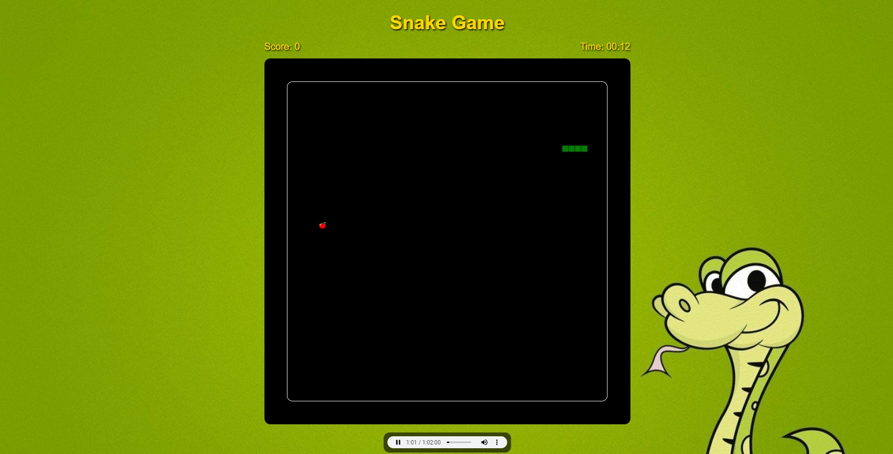

# Snake Game 🐍

Este é um projeto de Snake Game moderno e responsivo feito com HTML5, CSS3 e JavaScript puro.

# Características 🎯

- Jogo de cobra totalmente funcional.
- Pontuação e cronômetro.
- Suporta reprodução de música personalizada.
- Responsivo para dispositivos móveis.
- Gráficos modernos e atraentes.

# Instruções de Jogo 🎮

Use as teclas de seta do teclado para mover a cobra ao redor do tabuleiro. Tente comer as maçãs que aparecem aleatoriamente no tabuleiro. Cada maçã que você come aumenta a sua pontuação em 1 ponto e também o tamanho da cobra. Se a cobra se chocar com a borda do tabuleiro ou com ela mesma, o jogo acaba.

# Como Executar 🚀

Baixe ou clone o repositório no seu computador e abra o arquivo index.html em qualquer navegador moderno para jogar.

# Contribuição 💡

Se você quiser contribuir, por favor, faça um fork do repositório e use uma branch de feature. Pull requests são bem vindos.

# Licença 📝

Este projeto está sob a licença MIT. Veja o arquivo LICENSE para mais detalhes.
